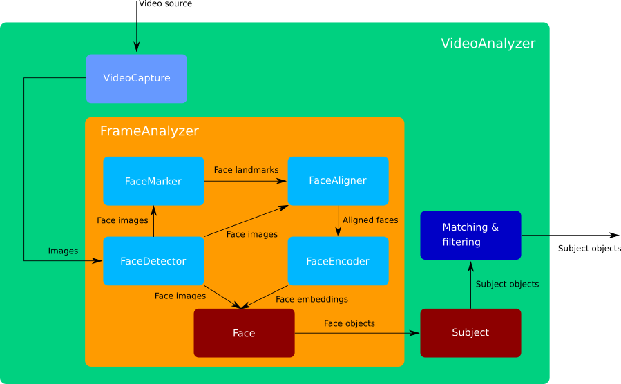

Dnfal
=======================

|Build Status| |Test Coverage| |Python Version| |Contributions Welcome| |License|

.. |Build Status| image:: https://travis-ci.com/raikel/dnfal.svg?branch=master
   :target: https://travis-ci.com/raikel/dnfal
.. |Test Coverage| image:: https://codecov.io/gh/raikel/dnfal/branch/master/graph/badge.svg
   :target: https://codecov.io/gh/raikel/dnfal
.. |Python Version| image:: https://img.shields.io/badge/python-v3.7+-blue.svg
   :target: http://shields.io/
.. |Contributions Welcome| image:: https://img.shields.io/badge/contributions-welcome-orange.svg
   :target: http://shields.io/
.. |License| image:: https://img.shields.io/badge/license-MIT-blue.svg
   :target: https://opensource.org/licenses/MIT

A deep learning-based library for real-time face analysis. The homepage of dnfal with user documentation is located on:

https://dnfal.readthedocs.io

Features
--------

- Face detection, alignment and encoding in images and videos.
- Real time performance on video analysis.
- Built on top of state-of-the-art deep learning models.
- High-performance pre-trained models available, you don't need to train any model.

Deep learning models and some core functionalities for face analysis where 
adapted from the following repositories:

- Code for face detection was adapted from `FaceBoxes.PyTorch <https://github.com/zisianw/FaceBoxes.PyTorch>`_, licensed under the Apache 2.0 license.
- Code for face landmark detection, alignment and encoding was adapted from `face.evoLVe.PyTorch <https://github.com/ZhaoJ9014/face.evoLVe.PyTorch>`_, copyright Jian Zhao, 2019, licensed under the MIT license.

Getting started
===============

You can use `pip` to install dnfal::

    pip install dnfal

Alternatively, you can download the latest source code using git::

    git clone git://github.com/raikel/dnfal.git

and run the setup command from the source directory::

    python setup.py install
    
Next, you must download the pretrained deep learning models from `here <https://github.com/raikel/dnfal/tree/master/models>`_. Uncompress the downloaded files in any directory of your choice. Three models are provided: `detector_weights.pth` (for face detection), `marker_weights.pth` (for face landmark detection) and `encoder_weights.pth` (for face encoding).

Example usages
==============

Here is some basic example usages of `dnfal`.

Face detection
--------------

.. code-block:: python

    from os import path    
    import cv2 as cv   
    from dnfal.detection import FaceDetector
    
    # A valid path to a image file
    IMAGE_PATH = 'people.jpg'
    
    # A valid path to a file containing the model weights of face detector
    WEIGHTS_PATH = 'detector_weights.pth'

    faces_detector = FaceDetector(
        weights_path=WEIGHTS_PATH,  
        min_score=0.9, 
        nms_thresh=0.7
    )
    
    image = cv.imread(IMAGE_PATH)
    h, w, = image.shape[0:2]

    boxes, scores = faces_detector.detect(image)

    for ind, box in enumerate(boxes):
        cv.rectangle(
            image, 
            pt1=(box[0], box[1]), 
            pt2=(box[2], box[3]), 
            color=(255, 0, 0), 
            thickness=2
        )
        cv2.putText(
            image,
            text=f'{scores[ind]:.3f}',
            org=(box[0], box[1] -10),
            fontFace=cv.FONT_HERSHEY_SIMPLEX,
            fontScale=0.5,
            color=(255, 255, 255),
            thickness=2,
            lineType=cv.LINE_AA
        )

    cv.imshow(f'Faces', image)

    ret = cv.waitKey()
    cv.destroyAllWindows()

Workflow to contribute
======================

To contribute to dnfal, first create an account on `github
<https://github.com/>`_. Once this is done, fork the `dnfal repository
<https://github.com/raikel/dnfal>`_ to have your own repository,
clone it using 'git clone' on the computers where you want to work. Make
your changes in your clone, push them to your github account, test them
on several computers, and when you are happy with them, send a pull
request to the main repository.